# Primitive System Database Schema

## Table: users

| Field        | Type                                   | Constraints           |
| ------------ | -------------------------------------- | --------------------- |
| id           | VARCHAR(255)                           | NOT NULL, PRIMARY KEY |
| username     | VARCHAR(255)                           | UNIQUE, NOT NULL      |
| password     | VARCHAR(255)                           | NOT NULL              |
| email        | VARCHAR(255)                           | UNIQUE, NOT NULL      |
| timestamp    | BIGINT                                 | NOT NULL              |
| UNIQUE INDEX | username_UNIQUE (username ASC) VISIBLE |
| UNIQUE INDEX | email_UNIQUE (email ASC) VISIBLE       |

## Table: spaces

| Field       | Type         | Constraints                    |
| ----------- | ------------ | ------------------------------ |
| id          | VARCHAR(255) | NOT NULL, PRIMARY KEY          |
| name        | VARCHAR(255) | NOT NULL                       |
| status      | VARCHAR(255) | NOT NULL                       |
| ownerId     | VARCHAR(255) | NOT NULL                       |
| description | VARCHAR(255) | NOT NULL                       |
| timestamp   | BIGINT       | NOT NULL                       |
| FOREIGN KEY |              | (ownerId) REFERENCES users(id) |

## Table: blogs

| Field       | Type         | Constraints                     |
| ----------- | ------------ | ------------------------------- |
| id          | VARCHAR(255) | NOT NULL, PRIMARY KEY           |
| title       | VARCHAR(255) | NOT NULL                        |
| content     | MEDIUMTEXT   | NOT NULL                        |
| userId      | VARCHAR(255) | NOT NULL                        |
| spaceId     | VARCHAR(255) | NOT NULL                        |
| author      | VARCHAR(255) | NOT NULL                        |
| timestamp   | BIGINT       | NOT NULL                        |
| FOREIGN KEY |              | (userId) REFERENCES users(id)   |
| FOREIGN KEY |              | (spaceId) REFERENCES spaces(id) |

## Table: likes

| Field       | Type         | Constraints                   |
| ----------- | ------------ | ----------------------------- |
| blogId      | VARCHAR(255) | NOT NULL                      |
| userId      | VARCHAR(255) | NOT NULL                      |
| PRIMARY KEY |              | (blogId, userId)              |
| FOREIGN KEY |              | (blogId) REFERENCES blogs(id) |
| FOREIGN KEY |              | (userId) REFERENCES users(id) |

## Table: comments

| Field       | Type         | Constraints                   |
| ----------- | ------------ | ----------------------------- |
| id          | VARCHAR(255) | NOT NULL, PRIMARY KEY         |
| blogId      | VARCHAR(255) | NOT NULL                      |
| userId      | VARCHAR(255) | NOT NULL                      |
| content     | TEXT         | NOT NULL                      |
| timestamp   | BIGINT       | NOT NULL                      |
| FOREIGN KEY |              | (blogId) REFERENCES blogs(id) |
| FOREIGN KEY |              | (userId) REFERENCES users(id) |

## Table: follows

| Field       | Type         | Constraints                        |
| ----------- | ------------ | ---------------------------------- |
| followerId  | VARCHAR(255) | NOT NULL                           |
| followingId | VARCHAR(255) | NOT NULL                           |
| PRIMARY KEY |              | (followingId, followerId)          |
| FOREIGN KEY |              | (followerId) REFERENCES users(id)  |
| FOREIGN KEY |              | (followingId) REFERENCES users(id) |

## Table: members

| Field       | Type         | Constraints                     |
| ----------- | ------------ | ------------------------------- |
| memberId    | VARCHAR(255) | NOT NULL                        |
| spaceId     | VARCHAR(255) | NOT NULL                        |
| isAdmin     | BOOLEAN      | NOT NULL DEFAULT FALSE          |
| PRIMARY KEY |              | (memberId, spaceId)             |
| FOREIGN KEY |              | (memberId) REFERENCES users(id) |
| FOREIGN KEY |              | (spaceId) REFERENCES spaces(id) |

## Table: chat

| Field       | Type         | Constraints                     |
| ----------- | ------------ | ------------------------------- |
| id          | VARCHAR(255) | NOT NULL, PRIMARY KEY           |
| spaceId     | VARCHAR(255) | NOT NULL                        |
| userId      | VARCHAR(255) | NOT NULL                        |
| username    | VARCHAR(255) | NOT NULL                        |
| content     | TEXT         | NOT NULL                        |
| timestamp   | BIGINT       | NOT NULL                        |
| FOREIGN KEY |              | (userId) REFERENCES users(id)   |
| FOREIGN KEY |              | (spaceId) REFERENCES spaces(id) |

## Table: last_read

| Field       | Type         | Constraints                      |
| ----------- | ------------ | -------------------------------- |
| userId      | VARCHAR(255) | NOT NULL                         |
| spaceId     | VARCHAR(255) | NOT NULL                         |
| lastReadId  | VARCHAR(255) | NOT NULL                         |
| PRIMARY KEY |              | (userId, spaceId)                |
| FOREIGN KEY |              | (userId) REFERENCES users(id)    |
| FOREIGN KEY |              | (spaceId) REFERENCES spaces(id)  |
| FOREIGN KEY |              | (lastReadId) REFERENCES chat(id) |

## SQL Statements in migrations

```sql
CREATE TABLE IF NOT EXISTS users (
  id VARCHAR(255) NOT NULL,
  username VARCHAR(255) UNIQUE NOT NULL,
  password VARCHAR(255) NOT NULL,
  email VARCHAR(255) UNIQUE NOT NULL,
  PRIMARY KEY (id),
  timestamp BIGINT NOT NULL,
  UNIQUE INDEX username_UNIQUE (username ASC) VISIBLE,
  UNIQUE INDEX email_UNIQUE (email ASC) VISIBLE
);

CREATE TABLE IF NOT EXISTS spaces (
  id VARCHAR(255) NOT NULL,
  name VARCHAR(255) NOT NULL,
  status VARCHAR(255) NOT NULL,
  ownerId VARCHAR(255) NOT NULL,
  description VARCHAR(255) NOT NULL,
  timestamp BIGINT NOT NULL,
  PRIMARY KEY (id),
  FOREIGN KEY (ownerId) REFERENCES users(id)
);

CREATE TABLE IF NOT EXISTS blogs (
  id VARCHAR(255) NOT NULL,
  title VARCHAR(255) NOT NULL,
  content MEDIUMTEXT NOT NULL,
  userId VARCHAR(255) NOT NULL,
  spaceId VARCHAR(255) NOT NULL,
  author VARCHAR(255) NOT NULL,
  timestamp BIGINT NOT NULL,
  PRIMARY KEY (id),
  FOREIGN KEY (userId) REFERENCES users(id),
  FOREIGN KEY (spaceId) REFERENCES spaces(id)
);

CREATE TABLE IF NOT EXISTS likes (
  blogId VARCHAR(255) NOT NULL,
  userId VARCHAR(255) NOT NULL,
  PRIMARY KEY (blogId, userId),
  FOREIGN KEY (blogId) REFERENCES blogs(id),
  FOREIGN KEY (userId) REFERENCES users(id)
);

CREATE TABLE IF NOT EXISTS comments (
  id VARCHAR(255) NOT NULL,
  blogId VARCHAR(255) NOT NULL,
  userId VARCHAR(255) NOT NULL,
  content TEXT NOT NULL,
  timestamp BIGINT NOT NULL,
  PRIMARY KEY (id),
  FOREIGN KEY (blogId) REFERENCES blogs(id),
  FOREIGN KEY (userId) REFERENCES users(id)
);

CREATE TABLE IF NOT EXISTS follows (
  followerId VARCHAR(255) NOT NULL,
  followingId VARCHAR(255) NOT NULL,
  PRIMARY KEY (followingId, followerId),
  FOREIGN KEY (followerId) REFERENCES users(id),
  FOREIGN KEY (followingId) REFERENCES users(id)
);

CREATE TABLE IF NOT EXISTS members (
  memberId VARCHAR(255) NOT NULL,
  spaceId VARCHAR(255) NOT NULL,
  isAdmin BOOLEAN NOT NULL DEFAULT FALSE,
  PRIMARY KEY (memberId, spaceId)
);

CREATE TABLE IF NOT EXISTS chat (
  id VARCHAR(255) NOT NULL,
  spaceId VARCHAR(255) NOT NULL,
  userId VARCHAR(255) NOT NULL,
  username VARCHAR(255) NOT NULL,
  content TEXT NOT NULL,
  timestamp BIGINT NOT NULL,
  PRIMARY KEY (id),
  FOREIGN KEY (userId) REFERENCES users(id),
  FOREIGN KEY (spaceId) REFERENCES spaces(id)
);

CREATE TABLE IF NOT EXISTS last_read (
  userId VARCHAR(255) NOT NULL,
  spaceId VARCHAR(255) NOT NULL,
  lastReadId VARCHAR(255) NOT NULL,
  PRIMARY KEY (userId, spaceId),
  FOREIGN KEY (userId) REFERENCES users(id),
  FOREIGN KEY (spaceId) REFERENCES spaces(id),
  FOREIGN KEY (lastReadId) REFERENCES chat(id)
);
```

## Database Relationship Diagram (ERD)

```mermaid
erDiagram
    users ||--o{ spaces : owns
    users ||--o{ blogs : writes
    users ||--o{ comments : writes
    users ||--o{ likes : gives
    users ||--o{ follows : "follows/followed by"
    users ||--o{ members : "is member of"
    users ||--o{ chat : writes
    users ||--o{ last_read : tracks

    spaces ||--o{ blogs : contains
    spaces ||--o{ members : has
    spaces ||--o{ chat : contains
    spaces ||--o{ last_read : tracks

    blogs ||--o{ likes : receives
    blogs ||--o{ comments : has

    chat ||--o{ last_read : references

    users {
        VARCHAR(255) id PK
        VARCHAR(255) username UK
        VARCHAR(255) password
        VARCHAR(255) email UK
        BIGINT timestamp
    }

    spaces {
        VARCHAR(255) id PK
        VARCHAR(255) name
        VARCHAR(255) status
        VARCHAR(255) ownerId FK
        VARCHAR(255) description
        BIGINT timestamp
    }

    blogs {
        VARCHAR(255) id PK
        VARCHAR(255) title
        MEDIUMTEXT content
        VARCHAR(255) userId FK
        VARCHAR(255) spaceId FK
        VARCHAR(255) author
        BIGINT timestamp
    }

    likes {
        VARCHAR(255) blogId PK,FK
        VARCHAR(255) userId PK,FK
    }

    comments {
        VARCHAR(255) id PK
        VARCHAR(255) blogId FK
        VARCHAR(255) userId FK
        TEXT content
        BIGINT timestamp
    }

    follows {
        VARCHAR(255) followingId PK,FK
        VARCHAR(255) followerId PK,FK
    }

    members {
        VARCHAR(255) memberId PK,FK
        VARCHAR(255) spaceId PK,FK
        BOOLEAN isAdmin
    }

    chat {
        VARCHAR(255) id PK
        VARCHAR(255) spaceId FK
        VARCHAR(255) userId FK
        VARCHAR(255) username
        TEXT content
        BIGINT timestamp
    }

    last_read {
        VARCHAR(255) userId PK,FK
        VARCHAR(255) spaceId PK,FK
        VARCHAR(255) lastReadId FK
    }
```



## Description

The users table stores information about registered users, including their unique ID, username, password, email, and timestamp of account creation.

The spaces table represents different communities or groups in the system. It includes fields for the space ID, name, status, owner ID, description, and timestamp of creation. The owner ID is a foreign key referencing the users table.

The blogs table contains the blog posts created by users. It includes fields for the blog ID, title, content, user ID of the author, space ID where the blog belongs, author name, and timestamp of creation.

The likes table tracks the likes given by users to specific blogs. It has columns for the blog ID and user ID, forming a composite primary key.

The comments table stores the comments made by users on blogs. It includes fields for the comment ID, blog ID, user ID, content, and timestamp of creation.

The follows table represents the relationship between users who follow each other. It has two columns, followerId and followingId, which together form the primary key.

The members table represents the membership of users in different spaces with an admin flag indicating privileged access.

The chat table stores messages sent in space chats, including the user who sent it and the space it belongs to.

The last_read table tracks the last read message for each user in each space to maintain read status.
