# Primitive System Database Schema

# Database Design Documentation

## Tables Documentation

### Users Table

Stores user account information.

| Column    | Type         | Constraints      | Description            |
| --------- | ------------ | ---------------- | ---------------------- |
| id        | CHAR(36)     | PRIMARY KEY      | Unique user identifier |
| username  | VARCHAR(255) | UNIQUE, NOT NULL | User's display name    |
| password  | VARCHAR(255) | NOT NULL         | Hashed password        |
| email     | VARCHAR(255) | UNIQUE, NOT NULL | User's email address   |
| timestamp | BIGINT       | NOT NULL         | Creation timestamp     |

### Spaces Table

Represents community spaces/groups.

| Column      | Type         | Constraints            | Description                    |
| ----------- | ------------ | ---------------------- | ------------------------------ |
| id          | CHAR(36)     | PRIMARY KEY            | Unique space identifier        |
| name        | VARCHAR(255) | NOT NULL               | Space name                     |
| status      | VARCHAR(255) | NOT NULL               | Space status (active/inactive) |
| ownerId     | CHAR(36)     | FOREIGN KEY (users.id) | User who owns the space        |
| description | VARCHAR(255) | NOT NULL               | Space description              |
| timestamp   | BIGINT       | NOT NULL               | Creation timestamp             |

### Blogs Table

Stores blog posts within spaces.

| Column    | Type         | Constraints             | Description               |
| --------- | ------------ | ----------------------- | ------------------------- |
| id        | CHAR(36)     | PRIMARY KEY             | Unique blog identifier    |
| title     | VARCHAR(255) | NOT NULL                | Blog title                |
| content   | MEDIUMTEXT   | NOT NULL                | Blog content              |
| userId    | CHAR(36)     | FOREIGN KEY (users.id)  | Author of the blog        |
| spaceId   | CHAR(36)     | FOREIGN KEY (spaces.id) | Space containing the blog |
| author    | VARCHAR(255) | NOT NULL                | Author's display name     |
| timestamp | BIGINT       | NOT NULL                | Creation timestamp        |

### Likes Table

Tracks user likes on blogs.

| Column | Type     | Constraints                         | Description             |
| ------ | -------- | ----------------------------------- | ----------------------- |
| blogId | CHAR(36) | PRIMARY KEY, FOREIGN KEY (blogs.id) | Liked blog identifier   |
| userId | CHAR(36) | PRIMARY KEY, FOREIGN KEY (users.id) | User who liked the blog |

### Comments Table

Stores comments on blogs.

| Column    | Type     | Constraints            | Description               |
| --------- | -------- | ---------------------- | ------------------------- |
| id        | CHAR(36) | PRIMARY KEY            | Unique comment identifier |
| blogId    | CHAR(36) | FOREIGN KEY (blogs.id) | Blog being commented on   |
| userId    | CHAR(36) | FOREIGN KEY (users.id) | User who made the comment |
| content   | TEXT     | NOT NULL               | Comment content           |
| timestamp | BIGINT   | NOT NULL               | Creation timestamp        |

### Follows Table

Manages user following relationships.

| Column      | Type     | Constraints                         | Description           |
| ----------- | -------- | ----------------------------------- | --------------------- |
| followerId  | CHAR(36) | PRIMARY KEY, FOREIGN KEY (users.id) | User who is following |
| followingId | CHAR(36) | PRIMARY KEY, FOREIGN KEY (users.id) | User being followed   |

### Members Table

Tracks space membership and admin status.

| Column   | Type     | Constraints            | Description                       |
| -------- | -------- | ---------------------- | --------------------------------- |
| memberId | CHAR(36) | PRIMARY KEY            | User who is a member              |
| spaceId  | CHAR(36) | PRIMARY KEY            | Space the user belongs to         |
| isAdmin  | BOOLEAN  | NOT NULL DEFAULT FALSE | Whether user has admin privileges |

### Chat Table

Stores chat messages within spaces.

| Column    | Type         | Constraints             | Description                            |
| --------- | ------------ | ----------------------- | -------------------------------------- |
| id        | CHAR(36)     | PRIMARY KEY             | Unique message identifier              |
| spaceId   | CHAR(36)     | FOREIGN KEY (spaces.id) | Space containing the message           |
| userId    | CHAR(36)     | FOREIGN KEY (users.id)  | User who sent the message              |
| username  | VARCHAR(255) | NOT NULL                | User's display name at time of sending |
| content   | TEXT         | NOT NULL                | Message content                        |
| timestamp | BIGINT       | NOT NULL                | Creation timestamp                     |

### Last_Read Table

Tracks last read chat messages per user per space.

| Column     | Type     | Constraints                          | Description               |
| ---------- | -------- | ------------------------------------ | ------------------------- |
| userId     | CHAR(36) | PRIMARY KEY, FOREIGN KEY (users.id)  | User identifier           |
| spaceId    | CHAR(36) | PRIMARY KEY, FOREIGN KEY (spaces.id) | Space identifier          |
| lastReadId | CHAR(36) | FOREIGN KEY (chat.id)                | Last read chat message ID |

### Private_Conversations Table

Manages private conversations between users.

| Column    | Type      | Constraints               | Description                    |
| --------- | --------- | ------------------------- | ------------------------------ |
| id        | CHAR(36)  | PRIMARY KEY               | Unique conversation identifier |
| user1Id   | CHAR(36)  | FOREIGN KEY (users.id)    | First participant              |
| user2Id   | CHAR(36)  | FOREIGN KEY (users.id)    | Second participant             |
| createdAt | TIMESTAMP | DEFAULT CURRENT_TIMESTAMP | Conversation creation time     |

### Private_Messages Table

Stores private messages between users.

| Column         | Type      | Constraints                            | Description                     |
| -------------- | --------- | -------------------------------------- | ------------------------------- |
| id             | CHAR(36)  | PRIMARY KEY                            | Unique message identifier       |
| conversationId | CHAR(36)  | FOREIGN KEY (private_conversations.id) | Conversation containing message |
| senderId       | CHAR(36)  | FOREIGN KEY (users.id)                 | User who sent the message       |
| content        | TEXT      | NOT NULL                               | Message content                 |
| createdAt      | TIMESTAMP | DEFAULT CURRENT_TIMESTAMP              | Message creation time           |

### User_Activity Table

Tracks user online status and last activity.

| Column     | Type      | Constraints                         | Description             |
| ---------- | --------- | ----------------------------------- | ----------------------- |
| userId     | CHAR(36)  | PRIMARY KEY, FOREIGN KEY (users.id) | User identifier         |
| lastActive | TIMESTAMP | NOT NULL DEFAULT CURRENT_TIMESTAMP  | Last activity timestamp |

### Tags Table

Stores available tags for categorization.

| Column | Type         | Constraints      | Description           |
| ------ | ------------ | ---------------- | --------------------- |
| id     | CHAR(36)     | PRIMARY KEY      | Unique tag identifier |
| name   | VARCHAR(100) | UNIQUE, NOT NULL | Tag name              |

### Blog_Tags Table

Links blogs to tags (many-to-many relationship).

| Column | Type     | Constraints                         | Description     |
| ------ | -------- | ----------------------------------- | --------------- |
| blogId | CHAR(36) | PRIMARY KEY, FOREIGN KEY (blogs.id) | Blog identifier |
| tagId  | CHAR(36) | PRIMARY KEY, FOREIGN KEY (tags.id)  | Tag identifier  |

### Space_Tags Table

Links spaces to tags (many-to-many relationship).

| Column  | Type     | Constraints                          | Description      |
| ------- | -------- | ------------------------------------ | ---------------- |
| spaceId | CHAR(36) | PRIMARY KEY, FOREIGN KEY (spaces.id) | Space identifier |
| tagId   | CHAR(36) | PRIMARY KEY, FOREIGN KEY (tags.id)   | Tag identifier   |

### User_Tags Table

Links users to tags (many-to-many relationship).

| Column | Type     | Constraints                         | Description     |
| ------ | -------- | ----------------------------------- | --------------- |
| userId | CHAR(36) | PRIMARY KEY, FOREIGN KEY (users.id) | User identifier |
| tagId  | CHAR(36) | PRIMARY KEY, FOREIGN KEY (tags.id)  | Tag identifier  |

### Blog_Series Table

Manages blog series/collections.

| Column      | Type         | Constraints               | Description              |
| ----------- | ------------ | ------------------------- | ------------------------ |
| id          | CHAR(36)     | PRIMARY KEY               | Unique series identifier |
| name        | VARCHAR(255) | NOT NULL                  | Series name              |
| description | TEXT         |                           | Series description       |
| createdBy   | CHAR(36)     | FOREIGN KEY (users.id)    | Series creator           |
| createdAt   | TIMESTAMP    | DEFAULT CURRENT_TIMESTAMP | Creation time            |

### Blog_Series_Links Table

Links blogs to series with ordering.

| Column   | Type     | Constraints                               | Description              |
| -------- | -------- | ----------------------------------------- | ------------------------ |
| seriesId | CHAR(36) | PRIMARY KEY, FOREIGN KEY (blog_series.id) | Series identifier        |
| blogId   | CHAR(36) | PRIMARY KEY, FOREIGN KEY (blogs.id)       | Blog identifier          |
| position | INT      | NOT NULL                                  | Order position in series |

### Notifications Table

Stores user notifications.

| Column    | Type      | Constraints               | Description                     |
| --------- | --------- | ------------------------- | ------------------------------- |
| id        | CHAR(36)  | PRIMARY KEY               | Unique notification identifier  |
| userId    | CHAR(36)  | FOREIGN KEY (users.id)    | Recipient user                  |
| type      | ENUM      | NOT NULL                  | Notification type               |
| refId     | CHAR(36)  |                           | Reference ID (blog/message/etc) |
| payload   | JSON      |                           | Additional notification data    |
| isRead    | BOOLEAN   | DEFAULT FALSE             | Read status                     |
| createdAt | TIMESTAMP | DEFAULT CURRENT_TIMESTAMP | Creation time                   |

### User_Conversation_State Table

Tracks user read states across conversations.

| Column            | Type      | Constraints            | Description                      |
| ----------------- | --------- | ---------------------- | -------------------------------- |
| id                | CHAR(36)  | PRIMARY KEY            | Unique state identifier          |
| userId            | CHAR(36)  | FOREIGN KEY (users.id) | User identifier                  |
| conversationId    | CHAR(36)  | NOT NULL               | Space or private conversation ID |
| conversationType  | ENUM      | NOT NULL               | Type of conversation             |
| lastReadAt        | TIMESTAMP |                        | Last read timestamp              |
| lastSoundPlayedAt | TIMESTAMP |                        | Last sound notification time     |

### Space_Permissions Table

Manages space-level permissions.

| Column      | Type     | Constraints             | Description                  |
| ----------- | -------- | ----------------------- | ---------------------------- |
| id          | CHAR(36) | PRIMARY KEY             | Unique permission identifier |
| spaceId     | CHAR(36) | FOREIGN KEY (spaces.id) | Space identifier             |
| permission  | ENUM     | NOT NULL                | Permission type              |
| allowedRole | ENUM     | DEFAULT 'member'        | Minimum role required        |

## Key Indexes

- `username_UNIQUE`, `email_UNIQUE` - User uniqueness constraints
- `idx_comments_blog_time` - Optimized comment retrieval
- `idx_chat_space_time` - Optimized chat message retrieval
- `idx_private_msg_convo_time` - Optimized private message retrieval
- `idx_space_createdAt` - Optimized blog listing by space
- `idx_notifications_user_unread` - Optimized notification queries
- `idx_user_convo_state_user` - Fast user conversation state lookup
- `idx_space_permissions_space_perm` - Efficient permission checks

## Relationships Summary

- **Users** have a one-to-many relationship with **Spaces** (ownership)
- **Spaces** have many **Blogs**, **Chat messages**, and **Members**
- **Blogs** can have multiple **Likes**, **Comments**, and **Tags**
- **Users** can follow other users through **Follows** table
- **Private conversations** enable direct messaging between users
- **Tags** categorize both **Blogs** and **Spaces** through junction tables
- **Blog series** organize multiple blogs in sequence
- **Notifications** and **User activity** track user engagement
- **Space permissions** control access levels within spaces

## SQL Statements in migrations

```sql
-- V1__create_table_users.sql
CREATE TABLE IF NOT EXISTS users (
  id VARCHAR(255) NOT NULL,
  username VARCHAR(255) UNIQUE NOT NULL,
  password VARCHAR(255) NOT NULL,
  email VARCHAR(255) UNIQUE NOT NULL,
  PRIMARY KEY (id),
  timestamp BIGINT NOT NULL,
  UNIQUE INDEX username_UNIQUE (username ASC) VISIBLE,
  UNIQUE INDEX email_UNIQUE (email ASC) VISIBLE
);

-- V2__create_table_spaces.sql
CREATE TABLE IF NOT EXISTS spaces (
  id VARCHAR(255) NOT NULL,
  name VARCHAR(255) NOT NULL,
  status VARCHAR(255) NOT NULL,
  ownerId VARCHAR(255) NOT NULL,
  description VARCHAR(255) NOT NULL,
  timestamp BIGINT NOT NULL,
  PRIMARY KEY (id),
  FOREIGN KEY (ownerId) REFERENCES users(id)
);

-- V3__create_tabel_blogs.sql
CREATE TABLE IF NOT EXISTS blogs (
  id VARCHAR(255) NOT NULL,
  title VARCHAR(255) NOT NULL,
  content MEDIUMTEXT NOT NULL,
  userId VARCHAR(255) NOT NULL,
  spaceId VARCHAR(255) NOT NULL,
  author VARCHAR(255) NOT NULL,
  timestamp BIGINT NOT NULL,
  PRIMARY KEY (id),
  FOREIGN KEY (userId) REFERENCES users(id),
  FOREIGN KEY (spaceId) REFERENCES spaces(id)
);

-- V4__create_table_likes.sql
CREATE TABLE IF NOT EXISTS likes (
  blogId VARCHAR(255) NOT NULL,
  userId VARCHAR(255) NOT NULL,
  PRIMARY KEY (blogId, userId),
  FOREIGN KEY (blogId) REFERENCES blogs(id),
  FOREIGN KEY (userId) REFERENCES users(id)
);

-- V5__create_table_comments.sql
CREATE TABLE IF NOT EXISTS comments (
  id VARCHAR(255) NOT NULL,
  blogId VARCHAR(255) NOT NULL,
  userId VARCHAR(255) NOT NULL,
  content TEXT NOT NULL,
  timestamp BIGINT NOT NULL,
  PRIMARY KEY (id),
  FOREIGN KEY (blogId) REFERENCES blogs(id),
  FOREIGN KEY (userId) REFERENCES users(id)
);

-- V6__create_table_follows.sql
CREATE TABLE IF NOT EXISTS follows (
  followerId VARCHAR(255) NOT NULL,
  followingId VARCHAR(255) NOT NULL,
  PRIMARY KEY (followingId, followerId),
  FOREIGN KEY (followerId) REFERENCES users(id),
  FOREIGN KEY (followingId) REFERENCES users(id)
);

-- V7__create_table_members.sql
CREATE TABLE IF NOT EXISTS members (
  memberId VARCHAR(255) NOT NULL,
  spaceId VARCHAR(255) NOT NULL,
  isAdmin BOOLEAN NOT NULL DEFAULT FALSE,
  PRIMARY KEY (memberId, spaceId)
);

-- V8__create_table_chat.sql
CREATE TABLE IF NOT EXISTS chat (
  id VARCHAR(255) NOT NULL,
  spaceId VARCHAR(255) NOT NULL,
  userId VARCHAR(255) NOT NULL,
  username VARCHAR(255) NOT NULL,
  content TEXT NOT NULL,
  timestamp BIGINT NOT NULL,
  PRIMARY KEY (id),
  FOREIGN KEY (userId) REFERENCES users(id),
  FOREIGN KEY (spaceId) REFERENCES spaces(id)
);

-- V9__create_table_last_read.sql
CREATE TABLE IF NOT EXISTS last_read (
  userId VARCHAR(255) NOT NULL,
  spaceId VARCHAR(255) NOT NULL,
  lastReadId VARCHAR(255) NOT NULL,
  PRIMARY KEY (userId, spaceId),
  FOREIGN KEY (userId) REFERENCES users(id),
  FOREIGN KEY (spaceId) REFERENCES spaces(id),
  FOREIGN KEY (lastReadId) REFERENCES chat(id)
);

-- V10__convert_ids_to_char36.sql
-- 1) Drop Foreign Keys (use the names from your query)
ALTER TABLE
  blogs DROP FOREIGN KEY blogs_ibfk_1;

ALTER TABLE
  blogs DROP FOREIGN KEY blogs_ibfk_2;

ALTER TABLE
  chat DROP FOREIGN KEY chat_ibfk_1;

ALTER TABLE
  chat DROP FOREIGN KEY chat_ibfk_2;

ALTER TABLE
  comments DROP FOREIGN KEY comments_ibfk_1;

ALTER TABLE
  comments DROP FOREIGN KEY comments_ibfk_2;

ALTER TABLE
  follows DROP FOREIGN KEY follows_ibfk_1;

ALTER TABLE
  follows DROP FOREIGN KEY follows_ibfk_2;

ALTER TABLE
  last_read DROP FOREIGN KEY last_read_ibfk_1;

ALTER TABLE
  last_read DROP FOREIGN KEY last_read_ibfk_2;

ALTER TABLE
  last_read DROP FOREIGN KEY last_read_ibfk_3;

ALTER TABLE
  likes DROP FOREIGN KEY likes_ibfk_1;

ALTER TABLE
  likes DROP FOREIGN KEY likes_ibfk_2;

ALTER TABLE
  spaces DROP FOREIGN KEY spaces_ibfk_1;

-- 2) Alter Column Types to CHAR(36)
ALTER TABLE
  users
MODIFY
  id CHAR(36) NOT NULL;

ALTER TABLE
  spaces
MODIFY
  id CHAR(36) NOT NULL,
MODIFY
  ownerId CHAR(36) NOT NULL;

ALTER TABLE
  blogs
MODIFY
  id CHAR(36) NOT NULL,
MODIFY
  userId CHAR(36) NOT NULL,
MODIFY
  spaceId CHAR(36) NOT NULL;

ALTER TABLE
  chat
MODIFY
  id CHAR(36) NOT NULL,
MODIFY
  userId CHAR(36) NOT NULL,
MODIFY
  spaceId CHAR(36) NOT NULL;

ALTER TABLE
  comments
MODIFY
  id CHAR(36) NOT NULL,
MODIFY
  blogId CHAR(36) NOT NULL,
MODIFY
  userId CHAR(36) NOT NULL;

ALTER TABLE
  follows
MODIFY
  followerId CHAR(36) NOT NULL,
MODIFY
  followingId CHAR(36) NOT NULL;

ALTER TABLE
  likes
MODIFY
  blogId CHAR(36) NOT NULL,
MODIFY
  userId CHAR(36) NOT NULL;

ALTER TABLE
  last_read
MODIFY
  userId CHAR(36) NOT NULL,
MODIFY
  spaceId CHAR(36) NOT NULL,
MODIFY
  lastReadId CHAR(36) NOT NULL;

-- 3) Recreate Foreign Keys with Meaningful Names
ALTER TABLE
  spaces
ADD
  CONSTRAINT fk_spaces_owner FOREIGN KEY (ownerId) REFERENCES users(id);

ALTER TABLE
  blogs
ADD
  CONSTRAINT fk_blogs_user FOREIGN KEY (userId) REFERENCES users(id),
ADD
  CONSTRAINT fk_blogs_space FOREIGN KEY (spaceId) REFERENCES spaces(id);

ALTER TABLE
  chat
ADD
  CONSTRAINT fk_chat_user FOREIGN KEY (userId) REFERENCES users(id),
ADD
  CONSTRAINT fk_chat_space FOREIGN KEY (spaceId) REFERENCES spaces(id);

ALTER TABLE
  comments
ADD
  CONSTRAINT fk_comments_blog FOREIGN KEY (blogId) REFERENCES blogs(id),
ADD
  CONSTRAINT fk_comments_user FOREIGN KEY (userId) REFERENCES users(id);

ALTER TABLE
  follows
ADD
  CONSTRAINT fk_follows_follower FOREIGN KEY (followerId) REFERENCES users(id),
ADD
  CONSTRAINT fk_follows_following FOREIGN KEY (followingId) REFERENCES users(id);

ALTER TABLE
  likes
ADD
  CONSTRAINT fk_likes_blog FOREIGN KEY (blogId) REFERENCES blogs(id),
ADD
  CONSTRAINT fk_likes_user FOREIGN KEY (userId) REFERENCES users(id);

ALTER TABLE
  last_read
ADD
  CONSTRAINT fk_lastread_user FOREIGN KEY (userId) REFERENCES users(id),
ADD
  CONSTRAINT fk_lastread_space FOREIGN KEY (spaceId) REFERENCES spaces(id),
ADD
  CONSTRAINT fk_lastread_chat FOREIGN KEY (lastReadId) REFERENCES chat(id);

-- V11__create_table_private_conversations.sql
CREATE TABLE IF NOT EXISTS private_conversations (
  id CHAR(36) NOT NULL,
  user1Id CHAR(36) NOT NULL,
  user2Id CHAR(36) NOT NULL,
  createdAt TIMESTAMP DEFAULT CURRENT_TIMESTAMP,
  PRIMARY KEY (id),
  CONSTRAINT unique_user_pair UNIQUE (user1Id, user2Id),
  FOREIGN KEY (user1Id) REFERENCES users(id) ON DELETE CASCADE,
  FOREIGN KEY (user2Id) REFERENCES users(id) ON DELETE CASCADE
)

-- V12__create_table_private_messages.sql
CREATE TABLE IF NOT EXISTS private_messages (
  id CHAR(36) NOT NULL,
  conversationId CHAR(36) NOT NULL,
  senderId CHAR(36) NOT NULL,
  content TEXT NOT NULL,
  createdAt TIMESTAMP DEFAULT CURRENT_TIMESTAMP,
  PRIMARY KEY (id),
  FOREIGN KEY (conversationId) REFERENCES private_conversations(id) ON DELETE CASCADE,
  FOREIGN KEY (senderId) REFERENCES users(id) ON DELETE CASCADE,
  INDEX idx_conversation (conversationId),
  INDEX idx_sender (senderId)
)

-- V13__create_table_user_activity.sql
CREATE TABLE IF NOT EXISTS user_activity (
  userId CHAR(36) NOT NULL PRIMARY KEY,
  lastActive TIMESTAMP NOT NULL DEFAULT CURRENT_TIMESTAMP,
  FOREIGN KEY (userId) REFERENCES users(id) ON DELETE CASCADE
)

-- V14__create_table_tags.sql
CREATE TABLE IF NOT EXISTS tags (
  id CHAR(36) NOT NULL,
  name VARCHAR(100) NOT NULL UNIQUE,
  PRIMARY KEY (id)
)

-- V15__create_table_blog_tags.sql
CREATE TABLE IF NOT EXISTS blog_tags (
  blogId CHAR(36) NOT NULL,
  tagId CHAR(36) NOT NULL,
  PRIMARY KEY (blogId, tagId),
  FOREIGN KEY (blogId) REFERENCES blogs(id) ON DELETE CASCADE,
  FOREIGN KEY (tagId) REFERENCES tags(id) ON DELETE CASCADE
)

-- V16__create_table_space_tags.sql
CREATE TABLE IF NOT EXISTS space_tags (
  spaceId CHAR(36) NOT NULL,
  tagId CHAR(36) NOT NULL,
  PRIMARY KEY (spaceId, tagId),
  FOREIGN KEY (spaceId) REFERENCES spaces(id) ON DELETE CASCADE,
  FOREIGN KEY (tagId) REFERENCES tags(id) ON DELETE CASCADE
)

-- V26__create_table_user_tags.sql
CREATE TABLE IF NOT EXISTS user_tags (
  userId CHAR(36) NOT NULL,
  tagId CHAR(36) NOT NULL,
  PRIMARY KEY (userId, tagId),
  FOREIGN KEY (userId) REFERENCES users(id) ON DELETE CASCADE,
  FOREIGN KEY (tagId) REFERENCES tags(id) ON DELETE CASCADE
)

-- V17__create_table_blog_series.sql
CREATE TABLE IF NOT EXISTS blog_series (
  id CHAR(36) NOT NULL,
  name VARCHAR(255) NOT NULL,
  description TEXT,
  createdBy CHAR(36) NOT NULL,
  createdAt TIMESTAMP DEFAULT CURRENT_TIMESTAMP,
  PRIMARY KEY (id),
  FOREIGN KEY (createdBy) REFERENCES users(id) ON DELETE CASCADE
)

-- V18__create_table_blog_series_links.sql
CREATE TABLE IF NOT EXISTS blog_series_links (
  seriesId CHAR(36) NOT NULL,
  blogId CHAR(36) NOT NULL,
  position INT NOT NULL,
  PRIMARY KEY (seriesId, blogId),
  UNIQUE KEY unique_series_position (seriesId, position),
  FOREIGN KEY (seriesId) REFERENCES blog_series(id) ON DELETE CASCADE,
  FOREIGN KEY (blogId) REFERENCES blogs(id) ON DELETE CASCADE
)

-- V19__create_index_idx_comments_blog_time.sql
CREATE INDEX idx_comments_blog_time ON comments (blogId, timestamp);

-- V20__create_index_idx_chat_space_time.sql
CREATE INDEX idx_chat_space_time ON chat (spaceId, timestamp);

-- V21__create_index_idx_private_msg_convo_time.sql
CREATE INDEX idx_private_msg_convo_time ON private_messages (conversationId, createdAt);

-- V22__create_index_idx_space_createdAt.sql
CREATE INDEX idx_space_createdAt ON blogs (spaceId, timestamp);

-- V23__create_table_notifications.sql
CREATE TABLE IF NOT EXISTS notifications (
  id CHAR(36) NOT NULL,
  userId CHAR(36) NOT NULL,
  type ENUM('message', 'mention', 'comment', 'system') NOT NULL,
  refId CHAR(36) NULL,  -- reference to blog/message/comment/etc
  payload JSON NULL, -- optional additional data
  isRead BOOLEAN NOT NULL DEFAULT FALSE,
  createdAt TIMESTAMP DEFAULT CURRENT_TIMESTAMP,
  PRIMARY KEY (id),
  FOREIGN KEY (userId) REFERENCES users(id)
);

-- Optimize unread notifications query
CREATE INDEX idx_notifications_user_unread ON notifications (userId, isRead, createdAt);

-- V24__create_table_user_conversation_state.sql
CREATE TABLE IF NOT EXISTS user_conversation_state (
  id CHAR(36) NOT NULL,
  userId CHAR(36) NOT NULL,
  conversationId CHAR(36) NOT NULL, -- could be spaceId or private conversationId
  conversationType ENUM('space', 'private') NOT NULL,
  lastReadAt TIMESTAMP NULL,
  lastSoundPlayedAt TIMESTAMP NULL,
  PRIMARY KEY (id),
  UNIQUE KEY uq_user_conversation (userId, conversationId, conversationType),
  FOREIGN KEY (userId) REFERENCES users(id)
);

-- Index to quickly find unread state for a given user
CREATE INDEX idx_user_convo_state_user ON user_conversation_state (userId);

-- V25__create_table_space_permissions.sql
CREATE TABLE IF NOT EXISTS space_permissions (
  id CHAR(36) NOT NULL,
  spaceId CHAR(36) NOT NULL,
  permission ENUM('post_blog', 'send_chat') NOT NULL,
  allowedRole ENUM('owner', 'admin', 'member', 'everyone') NOT NULL DEFAULT 'member',

  PRIMARY KEY (id),
  UNIQUE KEY uq_space_permission (spaceId, permission),
  FOREIGN KEY (spaceId) REFERENCES spaces(id)
);

-- Backfill default permissions for all existing spaces
INSERT INTO space_permissions (id, spaceId, permission, allowedRole)
SELECT UUID(), id, 'post_blog', 'member' FROM spaces
WHERE NOT EXISTS (
  SELECT 1 FROM space_permissions sp WHERE sp.spaceId = spaces.id AND sp.permission = 'post_blog'
);

INSERT INTO space_permissions (id, spaceId, permission, allowedRole)
SELECT UUID(), id, 'send_chat', 'member' FROM spaces
WHERE NOT EXISTS (
  SELECT 1 FROM space_permissions sp WHERE sp.spaceId = spaces.id AND sp.permission = 'send_chat'
);

-- Index for fast lookups by space and permission
CREATE INDEX idx_space_permissions_space_perm
ON space_permissions (spaceId, permission);

```

## Entity Relationship Diagram (ERD)

```
Users
├── Spaces (owner)
│   ├── Blogs
│   │   ├── Likes
│   │   ├── Comments
│   │   └── Blog_Tags
│   ├── Chat
│   ├── Members
│   └── Space_Tags
├── Follows (follower/following relationships)
├── Private_Conversations
│   └── Private_Messages
├── User_Activity
├── Notifications
└── User_Conversation_State
```



```mermaid
erDiagram
    users {
        CHAR(36) id PK
        VARCHAR(255) username UK "NOT NULL"
        VARCHAR(255) password "NOT NULL"
        VARCHAR(255) email UK "NOT NULL"
        BIGINT timestamp "NOT NULL"
    }

    spaces {
        CHAR(36) id PK
        VARCHAR(255) name "NOT NULL"
        VARCHAR(255) status "NOT NULL"
        CHAR(36) ownerId FK "NOT NULL"
        VARCHAR(255) description "NOT NULL"
        BIGINT timestamp "NOT NULL"
    }

    blogs {
        CHAR(36) id PK
        VARCHAR(255) title "NOT NULL"
        MEDIUMTEXT content "NOT NULL"
        CHAR(36) userId FK "NOT NULL"
        CHAR(36) spaceId FK "NOT NULL"
        VARCHAR(255) author "NOT NULL"
        BIGINT timestamp "NOT NULL"
    }

    likes {
        CHAR(36) blogId PK,FK "NOT NULL"
        CHAR(36) userId PK,FK "NOT NULL"
    }

    comments {
        CHAR(36) id PK
        CHAR(36) blogId FK "NOT NULL"
        CHAR(36) userId FK "NOT NULL"
        TEXT content "NOT NULL"
        BIGINT timestamp "NOT NULL"
    }

    follows {
        CHAR(36) followerId PK,FK "NOT NULL"
        CHAR(36) followingId PK,FK "NOT NULL"
    }

    members {
        CHAR(36) memberId PK "NOT NULL"
        CHAR(36) spaceId PK "NOT NULL"
        BOOLEAN isAdmin "NOT NULL DEFAULT FALSE"
    }

    chat {
        CHAR(36) id PK
        CHAR(36) spaceId FK "NOT NULL"
        CHAR(36) userId FK "NOT NULL"
        VARCHAR(255) username "NOT NULL"
        TEXT content "NOT NULL"
        BIGINT timestamp "NOT NULL"
    }

    last_read {
        CHAR(36) userId PK,FK "NOT NULL"
        CHAR(36) spaceId PK,FK "NOT NULL"
        CHAR(36) lastReadId FK "NOT NULL"
    }

    private_conversations {
        CHAR(36) id PK
        CHAR(36) user1Id FK "NOT NULL"
        CHAR(36) user2Id FK "NOT NULL"
        TIMESTAMP createdAt "DEFAULT CURRENT_TIMESTAMP"
    }

    private_messages {
        CHAR(36) id PK
        CHAR(36) conversationId FK "NOT NULL"
        CHAR(36) senderId FK "NOT NULL"
        TEXT content "NOT NULL"
        TIMESTAMP createdAt "DEFAULT CURRENT_TIMESTAMP"
    }

    user_activity {
        CHAR(36) userId PK,FK "NOT NULL"
        TIMESTAMP lastActive "NOT NULL DEFAULT CURRENT_TIMESTAMP"
    }

    tags {
        CHAR(36) id PK
        VARCHAR(100) name UK "NOT NULL"
    }

    blog_tags {
        CHAR(36) blogId PK,FK "NOT NULL"
        CHAR(36) tagId PK,FK "NOT NULL"
    }

    space_tags {
        CHAR(36) spaceId PK,FK "NOT NULL"
        CHAR(36) tagId PK,FK "NOT NULL"
    }

    blog_series {
        CHAR(36) id PK
        VARCHAR(255) name "NOT NULL"
        TEXT description
        CHAR(36) createdBy FK "NOT NULL"
        TIMESTAMP createdAt "DEFAULT CURRENT_TIMESTAMP"
    }

    blog_series_links {
        CHAR(36) seriesId PK,FK "NOT NULL"
        CHAR(36) blogId PK,FK "NOT NULL"
        INT position "NOT NULL"
    }

    notifications {
        CHAR(36) id PK
        CHAR(36) userId FK "NOT NULL"
        ENUM type "NOT NULL"
        CHAR(36) refId
        JSON payload
        BOOLEAN isRead "DEFAULT FALSE"
        TIMESTAMP createdAt "DEFAULT CURRENT_TIMESTAMP"
    }

    user_conversation_state {
        CHAR(36) id PK
        CHAR(36) userId FK "NOT NULL"
        CHAR(36) conversationId "NOT NULL"
        ENUM conversationType "NOT NULL"
        TIMESTAMP lastReadAt
        TIMESTAMP lastSoundPlayedAt
    }

    space_permissions {
        CHAR(36) id PK
        CHAR(36) spaceId FK "NOT NULL"
        ENUM permission "NOT NULL"
        ENUM allowedRole "DEFAULT 'member'"
    }

    users ||--o{ spaces : owns
    users ||--o{ blogs : writes
    users ||--o{ comments : writes
    users ||--o{ likes : creates
    users ||--o{ follows : "follows/followed_by"
    users ||--o{ members : "is_member_of"
    users ||--o{ chat : sends
    users ||--o{ private_conversations : participates_in
    users ||--o{ private_messages : sends
    users ||--o{ user_activity : has
    users ||--o{ notifications : receives
    users ||--o{ user_conversation_state : maintains
    users ||--o{ blog_series : creates

    spaces ||--o{ blogs : contains
    spaces ||--o{ chat : contains
    spaces ||--o{ members : has
    spaces ||--o{ last_read : tracks
    spaces ||--o{ space_tags : categorized_by
    spaces ||--o{ space_permissions : defines

    blogs ||--o{ likes : receives
    blogs ||--o{ comments : receives
    blogs ||--o{ blog_tags : categorized_by
    blogs ||--o{ blog_series_links : "part_of_series"

    private_conversations ||--o{ private_messages : contains

    tags ||--o{ blog_tags : "tags_blogs"
    tags ||--o{ space_tags : "tags_spaces"

    blog_series ||--o{ blog_series_links : contains
```

## Relationship Descriptions

- **Users → Spaces**: One-to-Many (A user can own multiple spaces)
- **Spaces → Blogs**: One-to-Many (A space can contain multiple blogs)
- **Blogs → Likes**: One-to-Many (A blog can have multiple likes)
- **Blogs → Comments**: One-to-Many (A blog can have multiple comments)
- **Users → Follows**: Many-to-Many (Users can follow multiple other users)
- **Spaces → Members**: Many-to-Many (Spaces can have multiple members)
- **Spaces → Chat**: One-to-Many (A space can have multiple chat messages)
- **Private Conversations → Private Messages**: One-to-Many (A conversation can have multiple messages)
- **Tags → Blogs**: Many-to-Many (Tags can categorize multiple blogs)
- **Tags → Spaces**: Many-to-Many (Tags can categorize multiple spaces)
- **Blog Series → Blogs**: Many-to-Many (A series can contain multiple blogs in order)

This ERD represents a comprehensive social blogging platform with community spaces, private messaging, tagging systems, and notification features.
