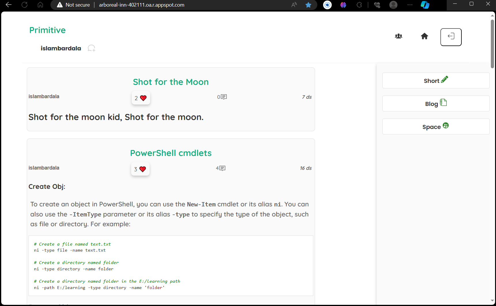
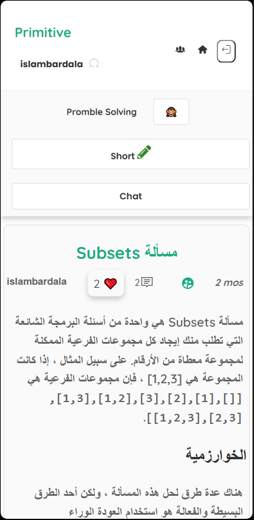

# Primitive

One possible way to spread knowledge, encourage reading, raise awareness, and fight the industry of ignorance is to create a platform where people can share their insights, opinions, and experiences on various topics. This platform would allow users to access a diverse range of perspectives, learn from each other, and engage in constructive dialogue. The platform would also promote literacy, critical thinking, and curiosity among its users, as well as foster a culture of respect and tolerance. By creating such a platform, we can empower people to seek the truth, challenge their assumptions, and broaden their horizons. You can access the application **[here](http://arboreal-inn-402111.oa.r.appspot.com)**.

_Notice, By the time you are reading this readme, the app link may be invalid or not working because the free trial was expired So you can see the **[Demo Video](https://www.youtube.com/watch?v=JHtCKUv_Xs8&t=369s&ab_channel=IslamBardala)** instead._

| Home Page                                       | Space Page                                    | Space Whole List                                    | Primitive Chat                                   |
| ----------------------------------------------- | --------------------------------------------- | --------------------------------------------------- | ------------------------------------------------ |
|  |  |  |  |

## Table of Contents

- [Features](#features)
- [Technologies Used](#technologies-used)
- [Why this technologies?](#why-this-technologies)
- [Usage](#usage)

  - [Users](#users)
  - [Posts and Blogs](#posts-and-blogs)
  - [Spaces](#spaces)
  - [User Profile](#user-profile)

- [What problem it solves?](#what-problem-it-solves)

## Features

- User authentication and registration with JWT.
- Chat System with Socket.IO.
- Notification system.
- Post creation, editing, and deletion with CRUD operations.
- Post like and unlike.
- Comment creation, and deletion with CRUD operations.
- User follow and unfollow.
- Markdown support for posts and comments with React Markdown.
- User profile with user information, posts, and spaces.
- Space creation, editing, and deletion with CRUD operations.
- Space join and leave.
- Space member addition and removal.
- Space member list.
- Responsive design to work on all screen sizes.

## Technologies Used

- **Node.js**.
- Express.js.
- **TypeScript**.
- **MySQL**.
- **React**.
- React Query.
- React Router.
- CSS.
- Socket.IO.
- React Markdown.
- MVC Architecture, Singleton, DAO Design and other design patterns.
- **Google Cloud Platform**, App Engine, Cloud SQL, and Compute Engine.
- Git and GitHub.
- VS Code.
- Thunder Client.

## Why this technologies?

- **Node.js**: Node.js is a JavaScript runtime built on Chrome's V8 JavaScript engine. Node.js uses an event-driven, non-blocking I/O model that makes it lightweight and efficient. It is a great choice for building highly scalable, data-intensive, and real-time applications.
- **Express.js**: Express.js is a minimal and flexible Node.js web application framework that provides a robust set of features for web and mobile applications.
- **TypeScript**: TypeScript is a strongly typed programming language which builds on JavaScript, giving you better tooling at any scale.
- **MySQL**: MySQL is an open-source relational database management system. Its name is a combination of "My", the name of co-founder Michael Widenius's daughter, and "SQL", the abbreviation for Structured Query Language.
- **React**: React is an open-source, front end, JavaScript library for building user interfaces or UI components.
- **React Query**: React Query is often described as the missing data-fetching library for React, but in more technical terms, it makes fetching, caching, synchronizing and updating server state in your React applications a breeze.
- **React Router**: React Router is a collection of navigational components that compose declaratively with your application.
- **CSS**: CSS is a style sheet language used for describing the presentation of a document written in a markup language such as HTML.
- **Socket.IO**: Socket.IO enables real-time, bidirectional, and event-based communication.
- **React Markdown**: React Markdown enables you to render Markdown as React components.
- **MVC Architecture**: The Model-View-Controller (MVC) is an architectural pattern that separates an application into three main logical components: the model, the view, and the controller.
- **Singleton**: The Singleton pattern is a design pattern that restricts the instantiation of a class to one object.
- **DAO**: The Data Access Object (DAO) pattern is a structural pattern that allows us to isolate the application/business layer from the persistence layer (usually a relational database, but it could be any other persistence mechanism) using an abstract API.
- **Google Cloud Platform**: Google Cloud Platform, offered by Google, is a suite of cloud computing services that runs on the same infrastructure that Google uses internally for its end-user products, such as Google Search, Gmail, file storage, and YouTube.
- **App Engine**: App Engine is a fully managed, serverless platform for developing and hosting web applications at scale.
- **Cloud SQL**: Cloud SQL is a fully managed database service that makes it easy to set up, maintain, manage, and administer your relational PostgreSQL, MySQL, and SQL Server databases in the cloud.
- **Compute Engine**: Compute Engine delivers configurable virtual machines running in Google's data centers with access to high-performance networking infrastructure and block storage.
- **Git and GitHub**: Git is a free and open source distributed version control system designed to handle everything from small to very large projects with speed and efficiency. GitHub is a provider of Internet hosting for software development and version control using Git.
- **VS Code**: Visual Studio Code is a free source-code editor made by Microsoft for Windows, Linux and macOS.
- **Thunder Client**: Thunder Client is a REST client extension for VS Code.

## Usage

- To use this Primitive, you need to register an account or log in with an existing one.
- After logging in, you will be redirected to the home page.

### Users

- You can click on the `users list` button on the side bar to see all the users.
- You can `Follow` or `UnFollow` any user.
- You can click on the user item to go to his profile page.
- Once you go to the **User Profile Page**:
  - You can see his information on **the user card**.
  - You can see his **public spaces** which he joined.
  - You can see his **blogs** and **posts** which he created in public or in public spaces.
  - You can `Follow` or `UnFollow` him from his profile page.

### Posts and Blogs

- You can create a post by clicking the `Short` button on the side bar.
- By entering the title and content of your post, and then click the `Create` button to publish your post, or `Preview` button to preview your post.
- You can markdown your post to make it more beautiful and readable.
- You can also create a post by clicking the `Blog` button on the side bar.
- You can like or unlike any post by clicking the `Like` button on the post page.
- You can delete your post by clicking the `Delete` button on the post page.
- You can comment on any post by clicking the `Comment` button on the post page.
- The comment will be markdowned too.

### Spaces

- You can also create a new Space by clicking the `Space` button on the side bar.
- You should enter a name, the description of your space and set the state `Public` or `Private`, and then click the `Create` button to create your space.
- Once you create a space, you will be redirected to the space page.
- By clicking the `Monkey` on the sidebar, you can see all the navbar items:

  - `Home`: redirect to the home page.
  - `Short`: create a new post in a fast way.
    - `Blog`: create a blog.
    - `Members`: to see all members on the space.
    - `Add member`: to add a new member with `username` or with `id`.
    - `Edit space`: to edit the `name`, `description` and the `state` of the space.
    - `Chat`: to chat with space members.
    - `Leave space`: to leave the space.

- ### User Profile:

  - You can click on `Your name` button on the navbar to see your profile.
  - You can see your information on **the user card**.
  - You can see your and search on your **Spaces**.
  - You can see your **blogs** and **posts**.

## What problem it solves?

Currently the application in his first stages yet, but it is created for:

- Post purposeful content (learning content, thoughts, opinions, articles...). **It is a way to encourage knowledge and avoiding **
- Make the relationship with friends and people with the same interesting stronger.
- Protect users' privacy.
- Encourage the community involvement and contribution by being an open-source project that welcomes new features and ideas.
