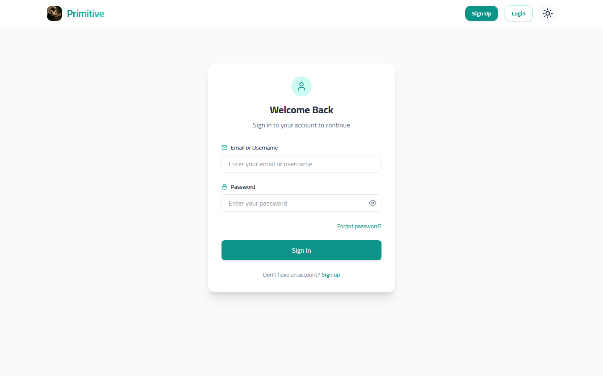
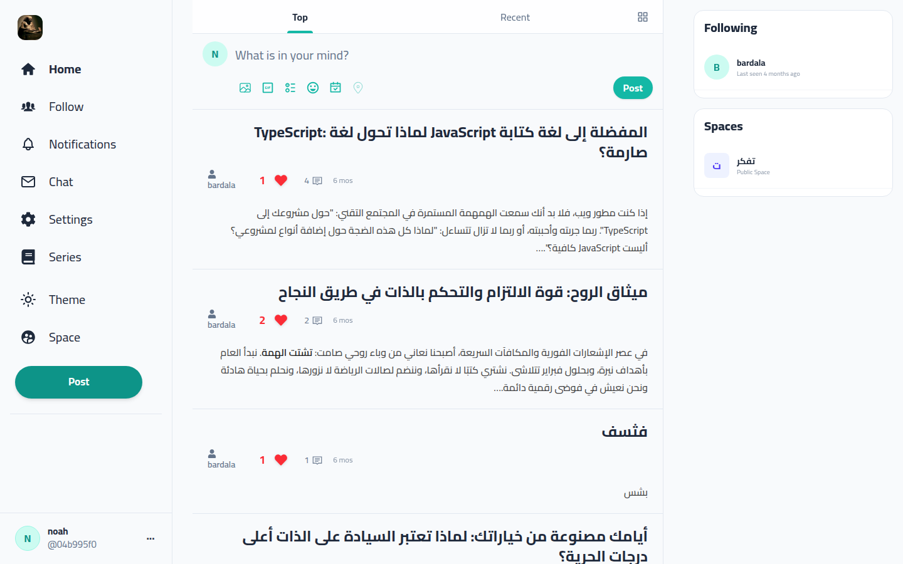
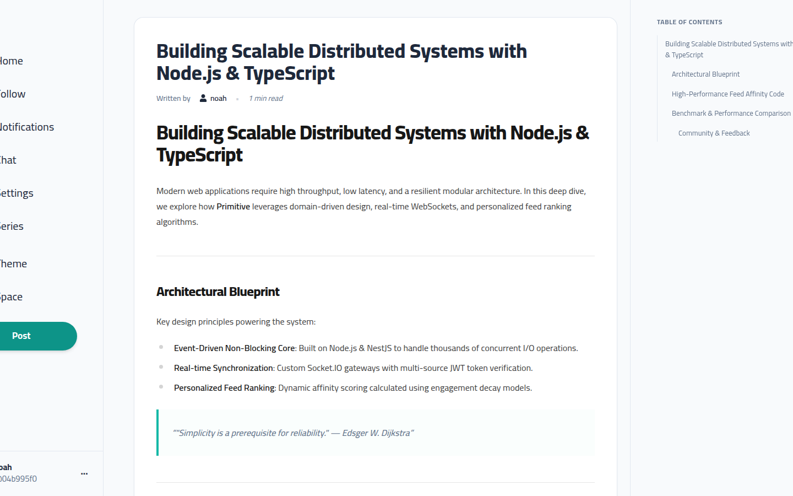
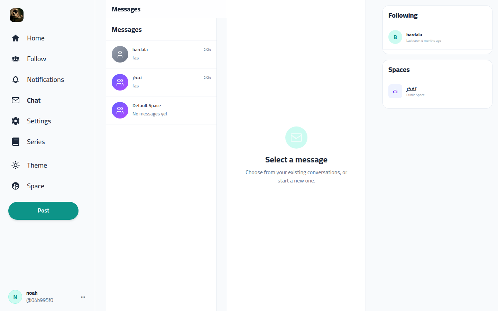
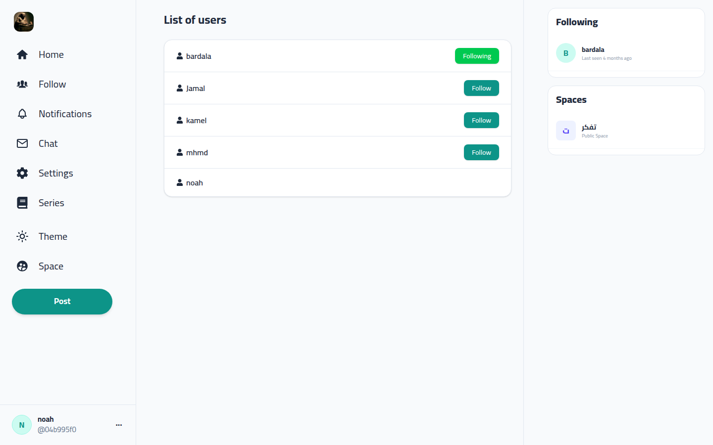
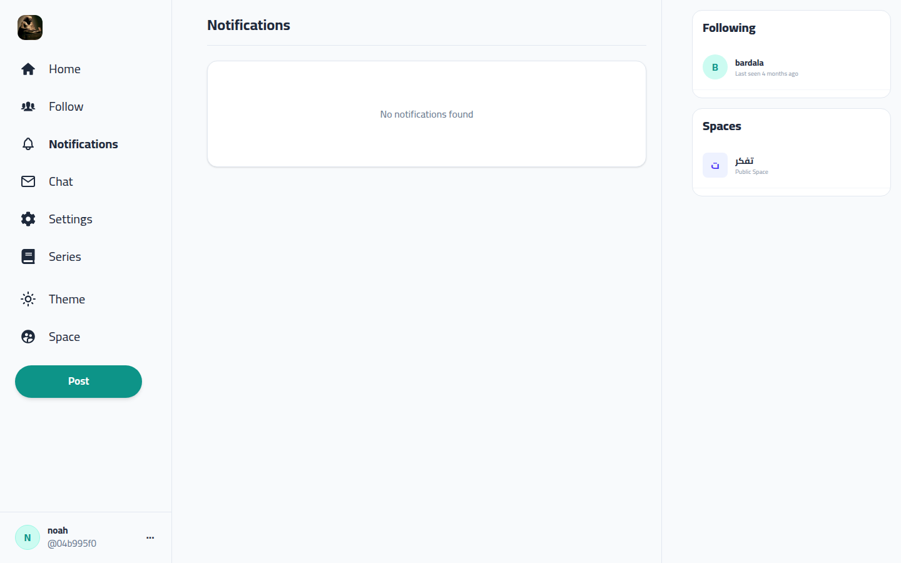
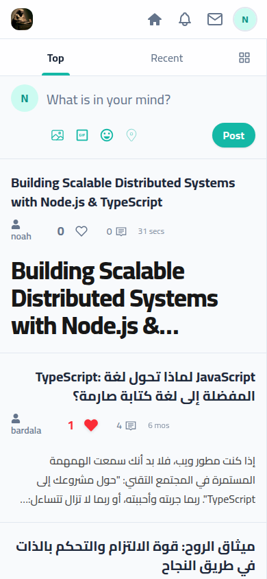
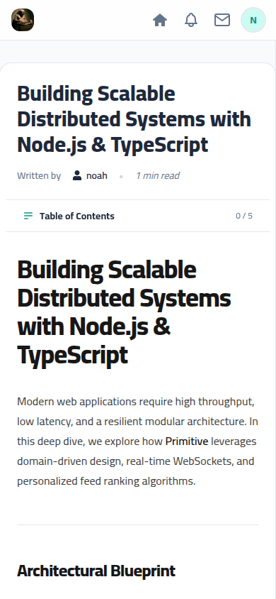
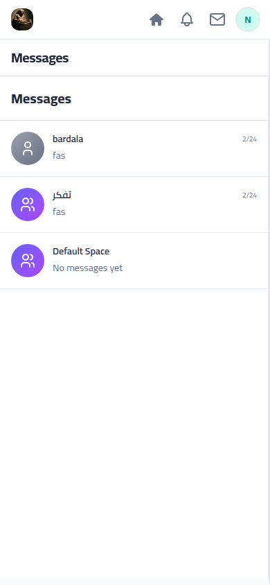

# Primitive 🚀

**Primitive** is a full-stack, domain-driven knowledge sharing and social platform engineered to foster meaningful discourse, deep article writing, community spaces, and real-time collaboration.

Built with a modular monorepo architecture, Primitive brings together real-time communication (Socket.IO), personalized feed ranking algorithms, role-based governance (RBAC), and shared cross-platform TypeScript contracts.

---

## 📸 Desktop View Showcase

| 🔐 **Sign In & Authentication** | 📰 **Algorithmic Home Feed** |
| :---: | :---: |
|  |  |

| ✍️ **English Article with Enhanced Markdown** | 💬 **Real-Time Workspace & Chat** |
| :---: | :---: |
|  |  |

| 👥 **Community & Follow Graph** | 🔔 **Activity Notifications** |
| :---: | :---: |
|  |  |

---

## 📱 Mobile Responsiveness Showcase

| 📰 **Mobile Home Feed** | ✍️ **Mobile Article Reader** | 💬 **Mobile Chat Channels** |
| :---: | :---: | :---: |
|  |  |  |

---

## 🛠 Tech Stack & Architecture

### Backend Architecture (`backend-nest`)
- **Framework**: NestJS (v11) with TypeScript
- **Database & ORM**: MySQL 8.0 & TypeORM with dynamic migration support
- **Real-Time Layer**: Socket.IO Gateway with custom `AuthenticatedSocketAdapter` supporting multi-source handshakes (Headers, Cookies, Query Params)
- **Security & Auth**: JWT authentication (HttpOnly cookies & Bearer tokens), Bcrypt password hashing, and custom `SpacePermission` Guards (RBAC)
- **API Documentation**: OpenAPI / Swagger integrated at `/api/docs`

### Frontend Application (`frontend`)
- **Framework**: React 18 with CRACO & TypeScript
- **State & Server Synchronization**: `@tanstack/react-query` (v5) with optimistic updates and cache invalidation
- **Routing & UI**: React Router DOM, Custom Vanilla CSS Design System, Responsive Layouts, and Theme Toggle (Light/Dark Mode)
- **Rich Content**: React Markdown rendering for posts, blogs, code blocks, tables, blockquotes, and comments

### Shared Contract Package (`shared`)
- **NPM Package**: `@nest/shared` — Shared source of truth for DTOs, API endpoint enumerations, permissions, and domain models, guaranteeing 100% type safety across frontend and backend.

---

## 📊 Technical Metrics & Scope

| Metric | Count | Details |
| :--- | :---: | :--- |
| **REST Endpoints** | **85** | Complete CRUD across Auth, Blogs, Spaces, Users, Comments, Likes, and Feeds |
| **WebSocket Handlers** | **6** | Presence, room joins/leaves, typing indicators, and message broadcasts |
| **Database Schema** | **21 Tables** | Normalized MySQL relational schema (Users, Blogs, Spaces, Chat, Tags, Permissions) |

---

## ⚡ Quick Start & Local Setup

### Prerequisites
- **Node.js**: `>= 20.x`
- **MySQL**: `>= 8.0` running locally or via Docker

### 1. Repository Installation
```bash
# Clone the repository
git clone https://github.com/islambardala/primitive.git
cd primitive

# Install dependencies across monorepo
npm install
```

### 2. Build Shared Contracts
```bash
npm run build:shared
```

### 3. Environment Configuration
Configure backend environment in `./backend-nest/.env`:
```env
PORT=4001
MYSQLHOST=127.0.0.1
MYSQLUSER=root
MYSQL_ROOT_PASSWORD=your_password
MYSQLPORT=3306
MYSQL_DATABASE=primitive_system
JWT_SECRET=your_jwt_secret_key
ORIGIN=http://localhost:3000
ALLOWED_ORIGINS=http://localhost:3000,http://127.0.0.1:3000
```

Configure frontend environment in `./frontend/.env`:
```env
REACT_APP_API_HOST=http://localhost:4001
```

### 4. Database Migrations
Run TypeORM schema migrations to set up the database tables:
```bash
npm run backend-migration
```

### 5. Run Application Locally
Start both backend and frontend development servers concurrently:
```bash
npm run start:dev
```
- **Frontend App**: [http://localhost:3000](http://localhost:3000)
- **Backend API**: [http://localhost:4001/api/v0](http://localhost:4001/api/v0)
- **Swagger Documentation**: [http://localhost:4001/api/docs](http://localhost:4001/api/docs)

---

## ✨ Core Features

- 🔑 **Authentication & Session**: Secure JWT registration, sign in, cookie management, and profile customization.
- 📰 **Algorithmic Feeds**: Time-decay weighted affinity feed calculation based on user interactions, likes, comments, and private messages.
- 🏡 **Spaces & Governance**: Custom community spaces with role-based member permissions (`post_blog`, `send_chat`, `invite_members`).
- ✍️ **Blog & Short Series**: Rich Markdown editing, blog series ordering with dynamic position updates, tagging system, and multi-user comments.
- 💬 **Real-time Chat**: Direct private messaging and space-wide persistent chat channels powered by Socket.IO with read receipts.
- 🔔 **Notification Center**: Event-driven alerts for likes, comments, followers, and space invitations.

---

## 📜 License
This project is open-source under the [ISC License](LICENSE).
